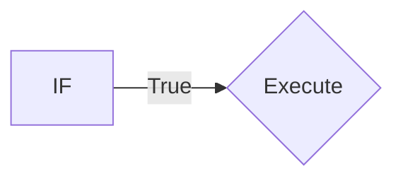
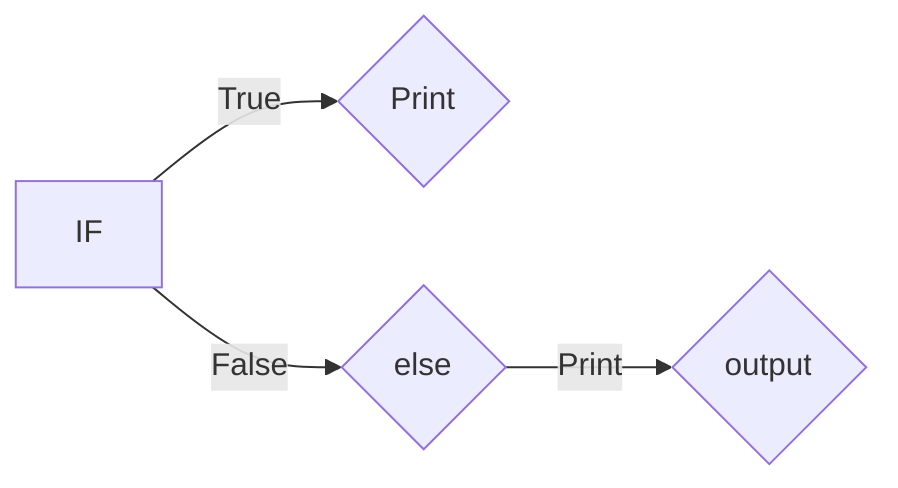

# Python Programming concept covered:
## Numerical Types
### ```Integer```
```python   
a=10
print(a)
```

### ```Float```
```python  
b=2.4
print(b)
```
## ```String```
```python  
a="HELLO"
```
## String Methods:
```upper()```: Converts to uppercase.

```lower()```: Converts to lowercase.

```capitalize()```: Capitalizes the first letter

```title()```: Capitalizes the first letter of each word

```count(substring)```~: Counts occurrences of a substring

```find(substring)```: Finds the index of the first occurrence 
of a substring

```replace(old, new)```: Replaces occurrences of one substring 
with another

```split(separator)```: Splits the string into a list of 
substrings

```join(list)```: Joins elements of a list into a string

```strip()```: Removes leading and trailing whitespace

```lstrip()```: Removes leading whitespace

```rstrip()```: Removes trailing whitespace   

## Slicing 
**a[start:stop:step]**
#
### Positive Slicing 
```python  
a="hello"
a[0:3]
```
### Negative Slicing
```python  
a="hello"
a[::-1]
```
## Casting 
**converting one data type into other.**
```python  
a="10"
int(a)
string becomes int.
```
# Data Types 
**1. List**

**2. Tuple**

**3. Dictionary**

**4. Set**
## 1.List and it's methods

* **List is mutable data types,ordered collections items.**
```python  
list=[1,2,3]

append()- list.append(4)             
[1,2,3,4]
        
clear()- list.clear()
        
extend()- list.extend([5, 6])                    
[1,2,3,4,5,6]
        
insert()- list.insert(1,10)
[1,10,2,3,4]

remove()- list.remove(10)
[1,2,3,4]
        
pop()- list.pop()
        
reverse()-list.reverse()
[3,2,1]
```
## 2.Tuple 

* **Tuple is immutable data types,once assign can't be changed.**
```python  
tuple=(1,2,3)
```
## 3.Dictionary methods

* **mutable,unordered collections of keys-values.**
#####
```python  
car=thisdict = {"brand": "Ford","model":        "Mustang","year": 1964}
```
### Methods
```python
update()
pop()
clear()
```### Accessing Values:
```python
value = my_dict['key1']  # Accessing value by key
```
### Modifying Values:
```python
my_dict['key1'] = 'new_value'
```
### Adding New Key-Value Pairs:
```python
my_dict['key3'] = 'value3'
```
### Checking if a Key Exists:
```python
if 'key4' in my_dict:
    print("Key exists")
else:
    print("Key does not exist")
```

### Deleting Key-Value Pairs:
```python
del my_dict['key2']
```
### Getting All Keys:
```python
keys = my_dict.keys()
```
### Getting All Values:
```python
values = my_dict.values()
```
### Getting All Key-Value Pairs:
```python
items = my_dict.items()
```
### Iterating Over Key-Value Pairs:
```python
for key, value in my_dict.items():
    print(key, value)
```

### Additional Operations:

#### Merging Dictionaries:
##### Unpacking Method
```python
dict1 = {'a': 1, 'b': 2}
dict2 = {'c': 3, 'd': 4}
merged_dict = {**dict1, **dict2}
```

#### Updating Values:
```python
my_dict.update({'key1': 'updated_value'})
```
#### Clearing a Dictionary:
```python
my_dict.clear()
```
#### Copying a Dictionary:
```python
new_dict = my_dict.copy()
```
### Example:

```python
    my_dict = {'name': 'Alice', 'age': 30, 'city': 'New York'}

    print(my_dict['name'])  # Output: Alice
    my_dict['age'] = 31
    print(my_dict)  # Output: {'name': 'Alice', 'age': 31, 'city': 'New York'}

    del my_dict['city']
    print(my_dict)  # Output: {'name': 'Alice', 'age': 31}

    for key, value in my_dict.items():
        print(key, value)
```

## 4.Sets 

* **Unordered collections of unique items.**
```python  
set=(1,2,3,4)
``` 
### Creating a Set:
```python
 my_set = {1, 2, 3, 4}
```

### Adding Elements:
```python
my_set.add(5)
```

### Removing Elements:
```python
my_set.remove(3)  # Raises KeyError if
 element not found
my_set.discard(6)  # Does not raise error if element not found
```

### Union of Sets:
```python
    set1 = {1, 2, 3}
    set2 = {3, 4, 5}
    union_set = set1.union(set2)  # Or set1 | set2
```

### Intersection of Sets:
```python
    intersection_set = set1.intersection(set2)  # Or set1 & set2
```

### Difference of Sets:
```python
    difference_set = set1.difference(set2)  # Or set1 - set2
```

### Symmetric Difference of Sets:
```python
    symmetric_difference_set = set1.symmetric_difference(set2)  # Or set1 ^ set2
```

### Checking Subsets and Supersets:
```python
    is_subset = set1.issubset(set2)
    is_superset = set1.issuperset(set2)
```

### Updating Sets:
```python
    set1.update(set2)  # Equivalent to union and assignment
    set1.intersection_update(set2)  # Equivalent to intersection and assignment
    set1.difference_update(set2)  # Equivalent to difference and assignment
    set1.symmetric_difference_update(set2)  # Equivalent to symmetric difference and assignment
```
# Conditional Statement

* **Allows us to excute code based on conditions.**
### Types:
  ### if statement:
  #### Syntax:
  * if condition:
  * (code execute if condition is true)

#
  ### else statement:
   #### Syntax:
  * if condition:
* else :
   * (if condition is false it goes to else condtion)

#
### elif statement:
  #### Syntax:
   if condition:
  * if condition1:
      * code if condition1 is true
* elif condition2:
    *   code if condition2 is true
* else:
    * code if neither condition is true

  * (code execute if condition is true) 
```python  
 x = 10
 if x > 0:
       print("True")
    elif x < 0:
        print("False")
    else:
        print("Zero")
```
  

# Loops
* iterate over a sequence.
#### For:
```python  
for i in range(5):
        print(i)
```


#### While:
```python  
count = 0
while count < 5:
    print(count)
    count += 1  
```

# Problem :
### using stack:
```python  
dict = {"(": ")", "{": "}", "[": "]"}
stack = []
string = "{[()()]}"

for char in string:
    # If it's an opening bracket
    if char in dict:  
        stack.append(char)
        elif char in dict.values():  
        # If it's a closing bracket
            if not stack or dict[stack.pop()] != char:
                balanced = False
                break
    else:
        # If stack is empty, it's balanced
        balanced = len(stack) == 0 
         

    print(balanced)
```
### using Adjecent:
```python
def is_valid(s):
    # Continuously check for and remove adjacent matching pairs of brackets
    while '()' in s or '{}' in s or '[]' in s:
        # Replace the found pairs with an empty string
        s = s.replace('()', '').replace('{}', '').replace('[]', '')
    
    # After all pairs are removed, check if the string is empty
    return s == ''  #all brackets were matched correctly
print(is_valid("[{}()]")) 
```
# Day-2
## Sorting
```python
list=[1,3,2,8,5,6,7,3]
n=len(list)
for i in range(n):
    for j in range(0,n-i-1):
        if list[j]>list[j+1]:               
                list[j], list[j+1] = list[j+1], list[j]

print('sorted list',list)
```
## Prefix 
```python
def common_prefix(lst):
    

    
    prefix = lst[0]     # assuming the first string is the common prefix

    for string in lst[1:]:  #looping from second sring from the lst

        # Reduce the prefix as long as the current string doesn't start with it
        while not string.startswith(prefix):    #If the current string does not start with the prefix, the loop will execute to reduce the prefix.
            prefix = prefix[:-1]  # Shorten the prefix
            
            if not prefix:  # If prefix becomes empty
                return False  # Return False if there's no common prefix

    return prefix   # Return the prefix or False if it's empty

lst = ['dog', 'door', 'done', 'doing','do']
result = common_prefix(lst)
print("Common prefix:", result)
```
