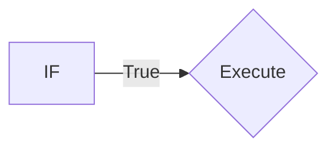
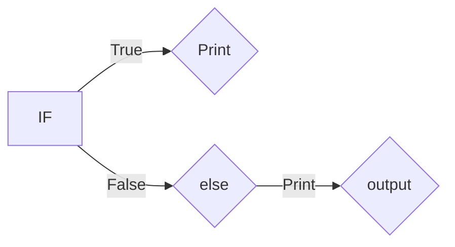

# Python Programming concept covered:
## Numerical Types
### ```Integer```
```python   
a=10
print(a)
```

### ```Float```
```python  
b=2.4
print(b)
```
## ```String```
```python  
a="HELLO"
```
## String Methods:
```upper()```: Converts to uppercase.

```lower()```: Converts to lowercase.

```capitalize()```: Capitalizes the first letter

```title()```: Capitalizes the first letter of each word

```count(substring)```~: Counts occurrences of a substring

```find(substring)```: Finds the index of the first occurrence 
of a substring

```replace(old, new)```: Replaces occurrences of one substring 
with another

```split(separator)```: Splits the string into a list of 
substrings

```join(list)```: Joins elements of a list into a string

```strip()```: Removes leading and trailing whitespace

```lstrip()```: Removes leading whitespace

```rstrip()```: Removes trailing whitespace   

## Slicing 
**a[start:stop:step]**
#
### Positive Slicing 
```python  
a="hello"
a[0:3]
```
### Negative Slicing
```python  
a="hello"
a[::-1]
```
## Casting 
**converting one data type into other.**
```python  
a="10"
int(a)
string becomes int.
```
# Data Types 
**1. List**

**2. Tuple**

**3. Dictionary**

**4. Set**
## 1.List and it's methods

* **List is mutable data types,ordered collections items.**
```python  
list=[1,2,3]

append()- list.append(4)             
[1,2,3,4]
        
clear()- list.clear()
        
extend()- list.extend([5, 6])                    
[1,2,3,4,5,6]
        
insert()- list.insert(1,10)
[1,10,2,3,4]

remove()- list.remove(10)
[1,2,3,4]
        
pop()- list.pop()
        
reverse()-list.reverse()
[3,2,1]
```
## 2.Tuple 

* **Tuple is immutable data types,once assign can't be changed.**
```python  
tuple=(1,2,3)
```
## 3.Dictionary methods

* **mutable,unordered collections of keys-values.**
#####
```python  
car=thisdict = {"brand": "Ford","model":        "Mustang","year": 1964}
```
### Methods
```python
update()
pop()
clear()
```
### Modifying Values:
```python
my_dict['key1'] = 'new_value'
```
### Adding New Key-Value Pairs:
```python
my_dict['key3'] = 'value3'
```
### Checking if a Key Exists:
```python
if 'key4' in my_dict:
    print("Key exists")
else:
    print("Key does not exist")
```

### Deleting Key-Value Pairs:
```python
del my_dict['key2']
```
### Getting All Keys:
```python
keys = my_dict.keys()
```
### Getting All Values:
```python
values = my_dict.values()
```
### Getting All Key-Value Pairs:
```python
items = my_dict.items()
```
### Iterating Over Key-Value Pairs:
```python
for key, value in my_dict.items():
    print(key, value)
```

### Additional Operations:

#### Merging Dictionaries:
##### Unpacking Method
```python
dict1 = {'a': 1, 'b': 2}
dict2 = {'c': 3, 'd': 4}
merged_dict = {**dict1, **dict2}
```

#### Updating Values:
```python
my_dict.update({'key1': 'updated_value'})
```
#### Clearing a Dictionary:
```python
my_dict.clear()
```
#### Copying a Dictionary:
```python
new_dict = my_dict.copy()
```
### Example:

```python
    my_dict = {'name': 'Alice', 'age': 30, 'city': 'New York'}

    print(my_dict['name'])  # Output: Alice
    my_dict['age'] = 31
    print(my_dict)  # Output: {'name': 'Alice', 'age': 31, 'city': 'New York'}

    del my_dict['city']
    print(my_dict)  # Output: {'name': 'Alice', 'age': 31}

    for key, value in my_dict.items():
        print(key, value)
```

## 4.Sets 

* **Unordered collections of unique items.**
```python  
set=(1,2,3,4)
``` 
### Creating a Set:
```python
 my_set = {1, 2, 3, 4}
```

### Adding Elements:
```python
my_set.add(5)
```

### Removing Elements:
```python
my_set.remove(3)  # Raises KeyError if
 element not found
my_set.discard(6)  # Does not raise error if element not found
```

### Union of Sets:
```python
    set1 = {1, 2, 3}
    set2 = {3, 4, 5}
    union_set = set1.union(set2)  # Or set1 | set2
```

### Intersection of Sets:
```python
    intersection_set = set1.intersection(set2)  # Or set1 & set2
```

### Difference of Sets:
```python
    difference_set = set1.difference(set2)  # Or set1 - set2
```

### Symmetric Difference of Sets:
```python
    symmetric_difference_set = set1.symmetric_difference(set2)  # Or set1 ^ set2
```

### Checking Subsets and Supersets:
```python
    is_subset = set1.issubset(set2)
    is_superset = set1.issuperset(set2)
```

### Updating Sets:
```python
    set1.update(set2)  # Equivalent to union and assignment
    set1.intersection_update(set2)  # Equivalent to intersection and assignment
    set1.difference_update(set2)  # Equivalent to difference and assignment
    set1.symmetric_difference_update(set2)  # Equivalent to symmetric difference and assignment
```
# Conditional Statement

* **Allows us to excute code based on conditions.**
### Types:
  ### if statement:
  #### Syntax:
  * if condition:
  * (code execute if condition is true)

#
  ### else statement:
   #### Syntax:
  * if condition:
* else :
   * (if condition is false it goes to else condtion)

#
### elif statement:
  #### Syntax:
   if condition:
  * if condition1:
      * code if condition1 is true
* elif condition2:
    *   code if condition2 is true
* else:
    * code if neither condition is true

  * (code execute if condition is true) 
```python  
 x = 10
 if x > 0:
       print("True")
    elif x < 0:
        print("False")
    else:
        print("Zero")
```
  

# Loops
* iterate over a sequence.
#### For:
```python  
for i in range(5):
        print(i)
```


#### While:
```python  
count = 0
while count < 5:
    print(count)
    count += 1  
```

# Problem :
### using stack:
```python  
dict = {"(": ")", "{": "}", "[": "]"}
stack = []
string = "{[()()]}"

for char in string:
    # If it's an opening bracket
    if char in dict:  
        stack.append(char)
        elif char in dict.values():  
        # If it's a closing bracket
            if not stack or dict[stack.pop()] != char:
                balanced = False
                break
    else:
        # If stack is empty, it's balanced
        balanced = len(stack) == 0 
         

    print(balanced)
```
### using Adjecent:
```python
def is_valid(s):
    # Continuously check for and remove adjacent matching pairs of brackets
    while '()' in s or '{}' in s or '[]' in s:
        # Replace the found pairs with an empty string
        s = s.replace('()', '').replace('{}', '').replace('[]', '')
    
    # After all pairs are removed, check if the string is empty
    return s == ''  #all brackets were matched correctly
print(is_valid("[{}()]")) 
```
# Day-2
## Sorting
```python
list=[1,3,2,8,5,6,7,3]
n=len(list)
for i in range(n):
    for j in range(0,n-i-1):
        if list[j]>list[j+1]:               
                list[j], list[j+1] = list[j+1], list[j]

print('sorted list',list)
```
## Prefix 
```python
def common_prefix(lst):
    

    
    prefix = lst[0]     # assuming the first string is the common prefix

    for string in lst[1:]:  #looping from second sring from the lst

        # Reduce the prefix as long as the current string doesn't start with it
        while not string.startswith(prefix):    #If the current string does not start with the prefix, the loop will execute to reduce the prefix.
            prefix = prefix[:-1]  # Shorten the prefix
            
            if not prefix:  # If prefix becomes empty
                return False  # Return False if there's no common prefix

    return prefix   # Return the prefix or False if it's empty

lst = ['dog', 'door', 'done', 'doing','do']
result = common_prefix(lst)
print("Common prefix:", result)
```
## Roman to Integer

```python

def romanToInt(s):
        roman_values  = {
            'I'  :  1 , 'V'  :  5 , 'X'  :  10 , 'L'  :  50  , 'C'  :  100  ,  'D'  :  500 , 'M'  : 1000
        }
        
        integer_value = 0

        for i in range(0,len(s)):
            if i < len(s) - 1 and roman_values[s[i]] < roman_values[s[i+1]]:
                integer_value -= roman_values[s[i]]
            else:
                integer_value += roman_values[s[i]]
        
        print(f'integer_value:{integer_value}') 
s='X'
print(romanToInt(s))
```
# Day-3
## Palindrome
```python
# Example input string
input_string = "10, %malayalam, 01 "

# Clean the string by keeping only alphanumeric characters and converting to lowercase
cleaned_string = ''.join(char.lower() for char in input_string if char.isalnum())

# Check if the cleaned string is equal to its reverse
is_palindrome = cleaned_string == cleaned_string[::-1]

# Output the result
if is_palindrome:
    print("palindrome.")
else:
    print("not a palindrome.")
```

## Max Profit
```

```
```python
def maxProfit(prices):
    if len(prices) == 0: 
            print(0)
    else:
        profit = 0
        minbuy = prices[0]
        for i in range(len(prices)):
            profit = max(prices[i] - minbuy, profit)
            minbuy = min(minbuy, prices[i])
        print(f'profit:{profit}')
prices=[4,3,2,1,0]
print(maxProfit(prices))   
```
# Decorators in Python
A decorator in Python is a function that allows you to modify the behavior of another function or method. Decorators enable adding functionality to existing functions or methods in a clean, readable, and reusable manner.
```python
Syntax:
@decorator_name
def function_name():
    # function body
Example of a Basic Decorator
def my_decorator(func):
    """
    A simple decorator that wraps the function
    with additional functionality.
    """
    def wrapper():
        print("Something before the function runs")
        func()  # Calling the original function
        print("Something after the function runs")
    return wrapper

@my_decorator
def say_hello():
    """A simple function that prints 'Hello!'"""
    print("Hello!")
```

# Why Use Decorators:
Code Reusability: Decorators allow you to define reusable wrappers for functions, so you don't have to repeat code across multiple functions.
Separation of Concerns: You can separate core logic from cross-cutting concerns like logging or error handling.
Enhanced Readability: Applying a decorator to a function using the @decorator_name syntax makes the code cleaner and more readable.
## Types Of Decorators:

1. @staticmethod

The @staticmethod decorator is used to define methods inside a class that don't need access to the instance (self) or the class (cls). They behave like regular functions but reside in the class' namespace.

Example Code:
```python
class MathOperations:
    @staticmethod
    def add(a, b):
        return a + b
```
# Calling the static method without creating an instance
```python
print(MathOperations.add(5, 3))  # Output: 8
```
2. @classmethod

The @classmethod decorator is used to define methods that work on the class level. The method receives the class (cls) as its first argument. These methods can modify class attributes and are often used for alternative constructors.

Example Code:
```python
class Animal:
    species = "Mammal"

    @classmethod
    def set_species(cls, new_species):
        cls.species = new_species
```
# Modifying the class attribute using a class method
```python
Animal.set_species("Reptile")
print(Animal.species)  # Output: Reptile
```
3. @property

The @property decorator is used to define a method as a property, which allows you to access it like an attribute. This is often used for getter methods, and @property can be paired with @setter to modify the behavior when setting a value.

Example Code:
```python
class Circle:
    def __init__(self, radius):
        self._radius = radius

    @property
    def area(self):
        return 3.1416 * (self._radius ** 2)

c = Circle(5)
print(c.area)  # Output: 78.54
```
4. @functools.lru_cache

The @functools.lru_cache decorator is used to cache the results of a function, making it more efficient for repeated calls with the same arguments. It stores the results in a cache and avoids recomputation for previously computed inputs.

Example Code:
```python
from functools import lru_cache

@lru_cache(maxsize=32)
def fibonacci(n):
    if n < 2:
        return n
    return fibonacci(n-1) + fibonacci(n-2)

print(fibonacci(10))  # Output: 55
```
5. @wraps (from functools)

The @wraps decorator is used to preserve the metadata (like the docstring and function name) of the original function when wrapped by another decorator. Without @wraps, the metadata of the original function would be lost when wrapped by a decorator.

Example Code:
```python
from functools import wraps

def my_decorator(func):
    @wraps(func)
    def wrapper(*args, **kwargs):
        print("Before function")
        result = func(*args, **kwargs)
        print("After function")
        return result
    return wrapper

@my_decorator
def greet(name):
    """Greets a person by name."""
    print(f"Hello, {name}")

greet("Alice")
print(greet.__name__)  # Output: greet
print(greet.__doc__)   # Output: Greets a person by name.
```
Note: These five decorators cover a wide range of functionality, from class-level methods to caching and preserving function metadata, and are commonly used in Python development.

.get() Method for Dictionaries:
The dict.get() method in Python is a safe way to retrieve the value of a key from a dictionary. Unlike accessing the key directly using square brackets ([]), get() allows you to specify a default value to return if the key is not found in the dictionary. If no default value is provided, it returns None.

Syntax:
```python
dict.get(key, default=None)
Parameters:
key (required): The key for which the value is to be retrieved from the dictionary.
default (optional): The value to return if the key is not found in the dictionary. If not provided, the method defaults to None.
Example Code:
my_dict = {'name': 'Alice', 'age': 25}
```
```python
# Retrieving an Existing Key
print(my_dict.get('name'))  # Output: Alice
```
```python
# Using a Default Value if Key is Absent
print(my_dict.get('gender', 'Not specified'))  # Output: Not specified
```
```python
# Returning None When the Key is Not Found
print(my_dict.get('address'))  # Output: None
```
 # Comprehensions in Python
Comprehensions in Python are concise syntactic constructs that allow for the creation of collections such as lists, sets, or dictionaries in a clear and efficient manner. Comprehensions help make the code more readable and can often result in fewer lines of code compared to traditional loops.

## Types of Comprehensions
1.List Comprehension

A list comprehension creates a new list by applying an expression to each item in an iterable, optionally filtering items with a conditional statement.

Syntax:
```python
new_list = [expression for item in iterable if condition]
```
Example:
```
# Create a list of squares for even numbers from 0 to 9
squares = [x**2 for x in range(10) if x % 2 == 0]
print(squares)  # Output: [0, 4, 16, 36, 64]
```
2.Set Comprehension

A set comprehension creates a new set in a similar way to list comprehensions, ensuring that all items are unique.

Syntax:

new_set = {expression for item in iterable if condition}
Example
```python
# Create a set of unique vowels from a string
unique_vowels = {char for char in 'abracadabra' if char in 'aeiou'}
print(unique_vowels)  # Output: {'a'}
```
3.Dictionary Comprehension

A dictionary comprehension creates a new dictionary from an iterable, where each item is transformed into a key-value pair.

Syntax:

new_dict = {key_expression: value_expression for item in iterable if condition}
Example
```python
# Create a dictionary mapping numbers to their squares
squares_dict = {x: x**2 for x in range(5)}
print(squares_dict)  # Output: {0: 0, 1: 1, 2: 4, 3: 9, 4: 16}
```
4.Generator Comprehension

A generator comprehension is similar to list comprehensions but produces a generator object instead of a list. This is useful for large datasets where you want to save memory.
Syntax:
```python
new_generator = (expression for item in iterable if condition)
```
#### Example:
```python
# Create a generator for squares of even numbers

squares_gen = (x**2 for x in range(10) if x % 2 == 0)
print(list(squares_gen))  # Output: [0, 4, 16, 36, 64]
```
# Day-5
## Check if number in prime or not between two numbers
```python
#check the prime number
def prime(n):
    if n <= 1:
        return False
    for i in range(2,(n//2) + 1):
        if n % i == 0:
            return False
    return True
#start and end range 
def primes_in_range(start, end):
    #stores the prime num
    prime_numbers = []
    for num in range(start, end):
        if prime(num):
            prime_numbers.append(num)
            #return in prime lisr
    return prime_numbers 

# Example usage
start_range = int(input("Enter the start of the range: "))
end_range = int(input("Enter the end of the range: "))
primes = primes_in_range(start_range, end_range)
print(f"Prime numbers between {start_range} and {end_range}: {primes}")

```
## Using Generators 
```python
def is_prime(n):
    if n <= 1:
        return False
    for i in range(2, int(n**0.5) + 1):  # Check up to the square root of n
        if n % i == 0:
            return False
    return True

def primes_in_range(start, end):
    """Generator for prime numbers in a given range."""
    for num in range(start, end):
        if is_prime(num):
            yield num  # Yield prime numbers one at a time

# Example usage
start_range = int(input("Enter the start of the range: "))
end_range = int(input("Enter the end of the range: "))
primes = (primes_in_range(start_range, end_range))  # Convert generator to list
print(next(primes))  # Print the first prime number
print(next(primes))  # Print the second prime number
print(next(primes))  # Print the third prime number
```
## Fibonacci using Generators
```python
def fibonacci(n):
    a, b = 0, 1
    for j in range(n):
        yield a
        a, b = b, a + b

# Example usage
num = int(input("Enter the number of Fibonacci terms to generate: "))
fib = fibonacci(num)

print("Fibonacci sequence:")
for i in fib:
    print(i, end=' ')
```
## Class and Object
### class:-
Instance of object.
### object:-
Blue print of class.

### Example:
```python
class Person:
  def __init__(self, name, age):
    self.name = name
    self.age = age

p1 = Person("John", 36)

print(p1.name)
print(p1.age)
```
## Prime number program using class
```python
class PrimeChecker:
    def __init__(self, start, end):
        self.start = start
        self.end = end

    def is_prime(self, n):
        if n <= 1:
            return False
        for i in range(2, int(n//2) + 1):
            if n% i == 0:
                return False
        return True

    def find_primes(self):
        primes = []
        for num in range(self.start, self.end):
            if self.is_prime(num):
                primes.append(num)
        return primes

start_num = int(input("Enter the start of the range: ")) 
end_num = int(input("Enter the end of the range: "))    
checker = PrimeChecker(start_num, end_num)
prime = checker.find_primes()
print(prime)
```
## Fibonaaci series using class 
```python
class Fibonacci:
    def __init__(self, n):
        self.n = n
        self.a, self.b = 0, 1
        self.count = 0

    def __iter__(self):
        return self

    def __next__(self):
        if self.count < self.n:
            result = self.a
            self.a, self.b = self.b, self.a + self.b
            self.count += 1
            return result
        else:
            raise StopIteration

# Example usage
num = int(input("Enter the number of Fibonacci terms to generate: "))
fib_sequence = Fibonacci(num)

print("Fibonacci sequence:")
for number in fib_sequence:
    print(number, end=' ')
```
# Max Profit
```python
class Solution:
    def maxProfit(self, prices):
        #intial profit 0
        profit = 0
        #we start from 1 index from the 0 index does't have any previous value
        for i in range(1, len(prices)):
            #if the current i is greater than the previous value 
            if prices[i] > prices[i - 1]:
                #we add it to the intial profit 
                profit += prices[i] - prices[i - 1]
        return profit

#create object
solution = Solution()
prices = [7,1,4,5]  # giving the list
#returning the list to the fun 
result = solution.maxProfit(prices) 
print(f"Maximum profit:",result)
```
# Day 5

## Integer to Roman
```python
def int_to_roman(num):
    # Define the mapping of integers to Roman numerals using a dictionary
    roman_dict = {
        1000: "M", 900: "CM", 500: "D", 400: "CD",
        100: "C", 90: "XC", 50: "L", 40: "XL",
        10: "X", 9: "IX", 5: "V", 4: "IV", 1: "I"
    }

    roman_numeral = ""
    for i in sorted(roman_dict.keys(), reverse=True):
        while num >= i:
            roman_numeral += roman_dict[i]
            num -= i
    
    return roman_numeral

num =int(input("Enter a number: "))
print(int_to_roman(num))  

```