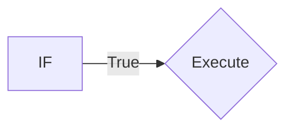
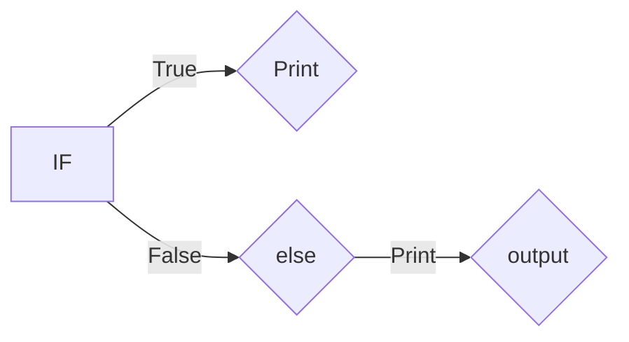

# Python Programming concept covered:
## Numerical Types
### Integer 
```python   
a=10
print(a)
```

### Float
```python  
b=2.4
print(b)
```
## String
```python  
a="HELLO"
```
## Slicing 
**a[start:stop:step]**
#
### Positive Slicing 
```python  
a="hello"
a[0:3]
```
### Negative Slicing
```python  
a="hello"
a[::-1]
```
## Casting 
**converting one data type into other.**
```python  
a="10"
int(a)
string becomes int.
```
# Data Types 
**1. List**

**2. Tuple**

**3. Dictionary**

**4. Set**
## 1.List and it's methods

* **List is mutable data types,ordered collections items.**
```python  
list=[1,2,3]

append()- list.append(4)             
[1,2,3,4]
        
clear()- list.clear()
        
extend()- list.extend([5, 6])                    
[1,2,3,4,5,6]
        
insert()- list.insert(1,10)
[1,10,2,3,4]

remove()- list.remove(10)
[1,2,3,4]
        
pop()- list.pop()
        
reverse()-list.reverse()
[3,2,1]
```
## 2.Tuple 

* **Tuple is immutable data types,once assign can't be changed.**
```python  
tuple=(1,2,3)
```
## 3.Dictionary methods

* **mutable,unordered collections of keys-values.**
#####
```python  
car=thisdict = {"brand": "Ford","model":        "Mustang","year": 1964}
```
### Methods
```python
update()
pop()
clear()
```
## 4.Sets 

* **Unordered collections of unique items.**
```python  
set=(1,2,3,4)
``` 
# Conditional Statement

* **Allows us to excute code based on conditions.**
### Types:
  ### if statement:
  #### Syntax:
  * if condition:
  * (code execute if condition is true)

#
  ### else statement:
   #### Syntax:
  * if condition:
* else :
   * (if condition is false it goes to else condtion)

#
### elif statement:
  #### Syntax:
   if condition:
  * if condition1:
      * code if condition1 is true
* elif condition2:
    *   code if condition2 is true
* else:
    * code if neither condition is true

  * (code execute if condition is true) 
```python  
 x = 10
 if x > 0:
       print("True")
    elif x < 0:
        print("False")
    else:
        print("Zero")
```
  

# Loops
* iterate over a sequence.
#### For:
```python  
for i in range(5):
        print(i)
```


#### While:
```python  
count = 0
while count < 5:
    print(count)
    count += 1  
```

# Problem :
### using stack:
```python  
dict = {"(": ")", "{": "}", "[": "]"}
stack = []
string = "{[()()]}"

for char in string:
    # If it's an opening bracket
    if char in dict:  
        stack.append(char)
        elif char in dict.values():  
        # If it's a closing bracket
            if not stack or dict[stack.pop()] != char:
                balanced = False
                break
    else:
        # If stack is empty, it's balanced
        balanced = len(stack) == 0 
         

    print(balanced)
```
### using Adjecent:
```python
def is_valid(s):
    # Continuously check for and remove adjacent matching pairs of brackets
    while '()' in s or '{}' in s or '[]' in s:
        # Replace the found pairs with an empty string
        s = s.replace('()', '').replace('{}', '').replace('[]', '')
    
    # After all pairs are removed, check if the string is empty
    return s == ''  #all brackets were matched correctly
print(is_valid("[{}()]")) 
```
# Day-2
## Sorting
```python
list=[1,3,2,8,5,6,7,3]
n=len(list)
for i in range(n):
    for j in range(0,n-i-1):
        if list[j]>list[j+1]:               
                list[j], list[j+1] = list[j+1], list[j]

print('sorted list',list)
```
## Prefix 
```python
```
